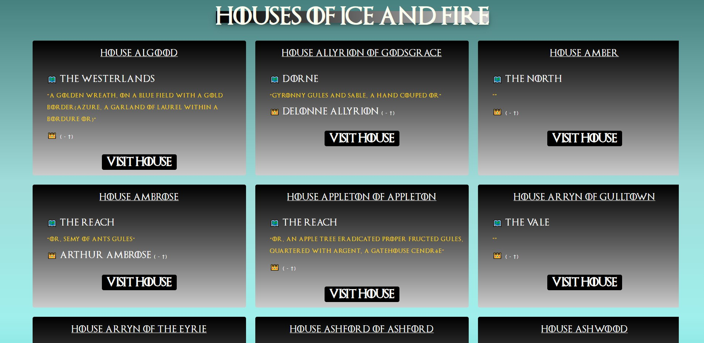
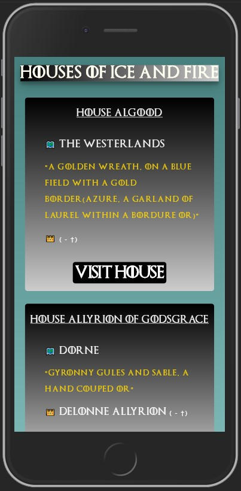

# MHP Web-App Coding Challenge

This project refers to the [:man_technologist:MHP Coding Challenge](https://github.com/MHP-A-Porsche-Company/coding-challenges/tree/master/Web).  

Technology-Stack:
- [NEXT.js](https://nextjs.org/)
  - [Styled Components](https://www.styled-components.com/)
  - [React Infinite Scroll Component](https://github.com/ankeetmaini/react-infinite-scroll-component#readme)  

## Install
- [Node.js](https://nodejs.org/en/) Version: 11.7.0
- [npm](https://www.npmjs.com) Version: 6.5.0  

Clone this repo and:

```
npm install
```

## Screenshots



